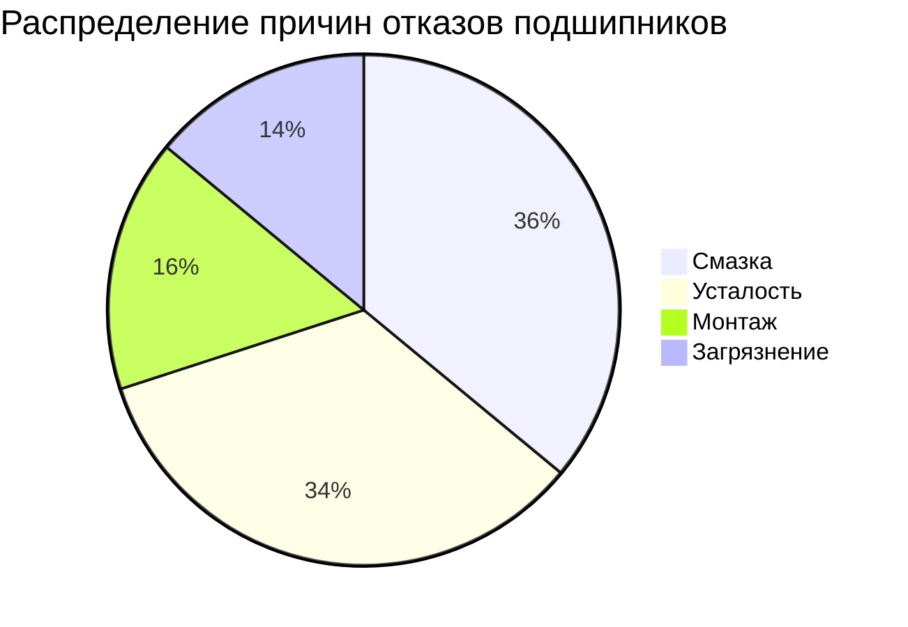
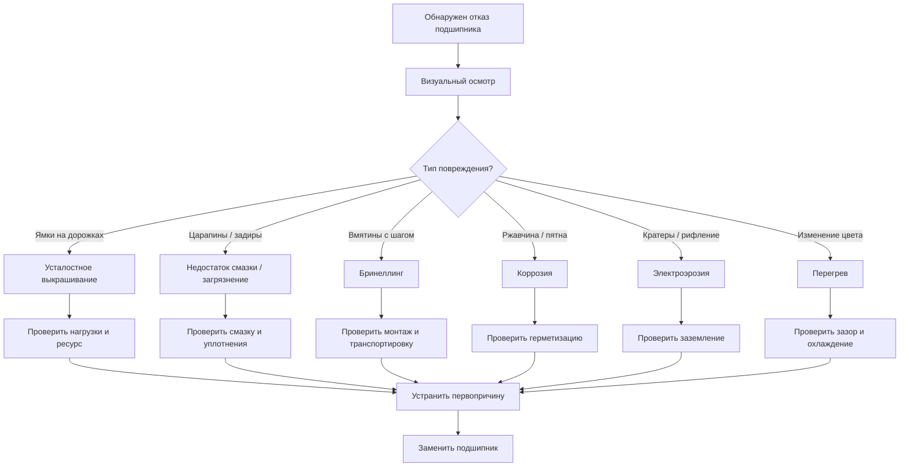
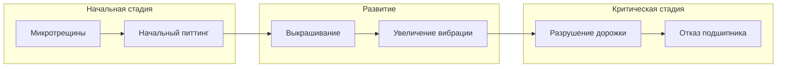

# Анализ отказов подшипников

Руководство по диагностике причин преждевременного выхода из строя подшипников и типовым дефектам.

## Контекст применения

- Определение причин отказа подшипника
- Предотвращение повторных отказов
- Улучшение условий эксплуатации
- Выявление ошибок монтажа и обслуживания

## Типовая статистика причин отказов

- **Смазка** (36%) — недостаток, избыток, загрязнение, старение
- **Загрязнение** (14%) — попадание пыли, воды, абразивных частиц
- **Монтаж** (16%) — неправильная установка, повреждения при монтаже
- **Усталость** (34%) — нормальный износ при достижении расчётного ресурса
- **Прочие** — перегрузки, коррозия, электроэрозия

## Виды дефектов и их причины

### 1. Усталостное выкрашивание (Spalling)

**Признаки**:
- Мелкие ямки на дорожках качения
- Начинается с подповерхностных трещин
- Прогрессирует от малых ямок к крупным

**Причины**:
- Достижение расчётного ресурса (нормальный износ)
- Перегрузка подшипника
- Недостаточная смазка

**Профилактика**:
- Расчёт ресурса по ISO 281
- Контроль нагрузок
- Регулярная замена смазки

### 2. Задиры и царапины на дорожках

**Признаки**:
- Линейные повреждения вдоль дорожек
- Потемневшие участки (перегрев)
- Отполированные участки

**Причины**:
- Недостаток смазки
- Попадание абразивных частиц
- Перекос колец (несоосность)
- Проскальзывание тел качения

**Профилактика**:
- Контроль количества и качества смазки
- Уплотнения для защиты от загрязнений
- Точная центровка валов

### 3. Вмятины (Brinelling)

**Признаки**:
- Углубления на дорожках с шагом, равным расстоянию между телами качения
- Повреждения симметричны по окружности

**Причины**:
- Статическая перегрузка при неподвижном подшипнике
- Удары и вибрации при транспортировке
- Ошибки монтажа (удары молотком)

**Типы**:
- **True Brinelling** — пластическая деформация от перегрузки
- **False Brinelling** — износ от микроперемещений при вибрации

**Профилактика**:
- Монтаж без ударов
- Защита от вибраций при транспортировке
- Контроль статических нагрузок

### 4. Коррозия

**Признаки**:
- Ржавчина на дорожках и телах качения
- Красно-коричневые пятна
- Потеря блеска поверхностей

**Причины**:
- Попадание влаги
- Конденсация при перепадах температуры
- Агрессивная среда
- Старение смазки (потеря защитных свойств)

**Типы**:
- **Поверхностная коррозия** — начальная стадия
- **Питтинговая коррозия** — локальные очаги
- **Фреттинг-коррозия** — между кольцом и посадочной поверхностью

**Профилактика**:
- Герметизация узла (уплотнения)
- Регулярная замена смазки
- Защита от конденсата

### 5. Электроэрозия (Electric Pitting)

**Признаки**:
- Мелкие кратеры на дорожках (следы искр)
- Тёмный цвет (обугливание смазки)
- Рифлёная поверхность

**Причины**:
- Прохождение электрического тока через подшипник
- Статическое электричество
- Сварка вблизи подшипника без заземления

**Профилактика**:
- Изоляция подшипников
- Заземление валов
- Защита при сварочных работах

### 6. Перегрев

**Признаки**:
- Изменение цвета металла (синий, коричневый)
- Размягчение колец (потеря твёрдости)
- Обугливание смазки

**Причины**:
- Недостаток смазки
- Чрезмерная затяжка (малый зазор)
- Высокие обороты при недостаточном охлаждении
- Перегрузка

**Профилактика**:
- Контроль уровня и качества смазки
- Правильный выбор зазора (C3 для электродвигателей)
- Охлаждение узла

### 7. Износ сепаратора

**Признаки**:
- Трещины на сепараторе
- Деформация окон
- Износ контактных поверхностей с телами качения

**Причины**:
- Высокие обороты
- Вибрации и удары
- Перекосы
- Агрессивная смазка

**Профилактика**:
- Выбор подшипника с усиленным сепаратором для высоких оборотов
- Контроль центровки
- Совместимость смазки с материалом сепаратора

## Алгоритм диагностики

1. **Визуальный осмотр** — тип повреждений, локализация
2. **Анализ условий эксплуатации** — нагрузки, обороты, среда
3. **Проверка смазки** — количество, состояние, загрязнения
4. **Проверка монтажа** — соосность, посадки, зазоры
5. **Оценка ресурса** — сравнение с расчётным по ISO 281
6. **Определение первопричины** — устранение для предотвращения повтора

## Прогрессия дефектов

Раннее обнаружение дефекта на начальной стадии (микротрещины, питтинг) позволяет запланировать замену подшипника в удобное время. Игнорирование первых симптомов приводит к прогрессирующему разрушению и катастрофическому отказу узла.

## Примеры

### Пример 1: Преждевременный выход из строя подшипника электродвигателя

**Симптомы**: перегрев, шум, отказ через 2000 часов (вместо 20000)

**Диагностика**:
- Визуально: синий цвет колец, обугленная смазка
- Причина: перегрев из-за недостаточного зазора (CN вместо C3)

**Решение**: замена на 6305-2RS C3

### Пример 2: Выкрашивание дорожек редуктора

**Симптомы**: вибрация, металлическая стружка в масле

**Диагностика**:
- Визуально: усталостное выкрашивание
- Ресурс: 15000 часов (близко к расчётному 18000)

**Решение**: плановая замена, нормальный износ

### Пример 3: Вмятины на дорожках насоса

**Симптомы**: шум с периодичностью, вибрации

**Диагностика**:
- Визуально: вмятины с шагом тел качения
- Причина: вибрации при транспортировке без фиксации вала

**Решение**: замена подшипника, улучшение упаковки

## Частые ошибки

- Игнорирование анализа отказа — повторный выход из строя по той же причине
- Замена на точно такой же подшипник без изменения условий — повтор отказа
- Списывание на «плохое качество» без диагностики — пропуск реальной причины

## См. также

- [Эксплуатация и обслуживание](../maintenance/README.md)
- [Выбор подшипника](../selection/README.md)
- [Типы подшипников](../types/README.md)
- [Стандарты](../standards/README.md)

## Источники и примечания

- Source: ISO 15243:2017 "Rolling bearings — Damage and failures — Terms, characteristics and causes", каталоги SKF, FAG
- Notes: для точной диагностики рекомендуется лабораторный анализ

## Контроль качества

- [x] Есть метаданные (id/topic/status/source)
- [x] Понятно без внешнего контекста
- [x] Есть примеры
- [x] Нет противоречий
- [x] Есть 3–7 ссылок «См. также»
- [ ] Для `status: verified` нет `[[TBD]]`
